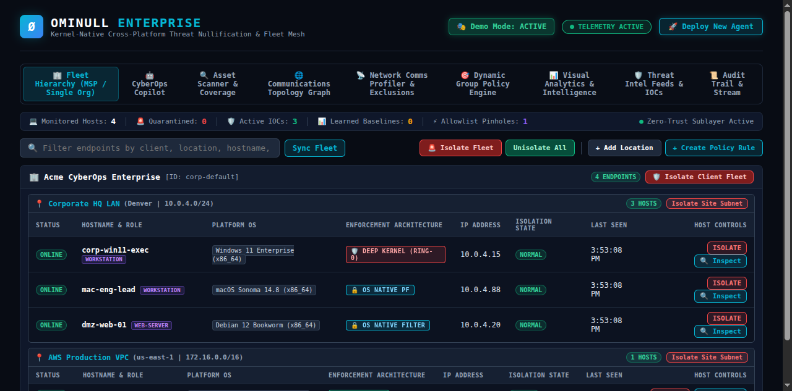

# Ominull: Autonomous CyberOps & Ring-0 Threat Nullification Platform

[](file:///srv/workspaces/projects/ominull/hub)
[](file:///srv/workspaces/projects/ominull/agent)
[](#system-architecture)
[](file:///srv/workspaces/projects/ominull/LICENSE)

**Ominull** is an enterprise-grade, ultra-lean kernel network security and autonomous Incident Response (IR) platform. It unifies microsecond ring-0 enforcement, in-flight Deep Packet Inspection (DPI), statistical behavioral anomaly detection, subnet quarantine mesh isolation, automated 1-click push-deployment, and an embedded 24/7 AI CyberOps Copilot into a single self-contained architecture.



> **🎭 Demo Mode:** The web console ships with a built-in demo mode (toggle button in the header, or append `?demo=true` to the URL) that renders the entire dashboard against seeded synthetic fleet data — no live endpoints, keys, or infrastructure required. Ideal for screenshots, evaluations, and public documentation.

---

## 1. System Architecture

```
┌────────────────────────────────────────────────────────────────────────────────────────┐
│                        CENTRAL MANAGEMENT HUB (LXC 150 / VM / BAREMETAL)               │
│                                  [ominull-hub Native Binary]                           │
│                                                                                        │
│  • Zero External Dependencies (Embedded SQLite + In-Memory Threat Intel IOC Cache)     │
│  • Multi-Tenant Hierarchy (MSPs / Enterprise Units / Locations / Dynamic Roles)       │
│  • Real-Time Web Console (Zero-CDN, Zero-NPM, Embedded Single-Binary Dashboard)        │
│  • In-Flight Stream DPI & DGA Shannon Entropy Heuristic Engine                         │
│  • Statistical Behavioral Anomaly Engine (Diurnal Baselines, Z-Scores, Fan-Out sweeps) │
│  • Automated 1-Click Push-Deployer (Pure-Go SSH Remote Provisioning Engine)            │
│  • Autonomous AI Security Copilot (Local Ollama llama3.2, Gemini Free Tier, OpenAI)   │
└───────────────────────────────────────────┬────────────────────────────────────────────┘
                                            │
           ┌────────────────────────────────┼────────────────────────────────┐
           │ mTLS / REST / WS               │ Telemetry Stream               │ MESH_ISOLATE_PEER
           ▼ (Port 9999 / 443)              ▼                                ▼
┌───────────────────────┐        ┌───────────────────────┐        ┌───────────────────────┐
│   WINDOWS ENDPOINT    │        │    LINUX ENDPOINT     │        │    macOS ENDPOINT     │
│  (Win 11 / Server 25) │        │ (Debian / Ubuntu / PVE│        │   (macOS 14+ Sonoma)  │
│                       │        │                       │        │                       │
│ • WFP Callout Driver  │        │ • eBPF / TC Classifier│        │ • pfctl Packet Anchor │
│   (ominull.sys)       │        │ • Socket Inode Finder │        │ • Process Associator  │
│ • User-Mode Daemon    │        │ • In-Flight TLS DPI   │        │ • Dynamic PF Drop Set │
│ • Forensic Pinholing  │        │ • Mesh Lateral Drop   │        │ • Subnet Mesh Shield  │
└───────────────────────┘        └───────────────────────┘        └───────────────────────┘
```

---

## 2. Core Capabilities

### 🛡️ Dual-Tier Network Threat Containment
1. **Ring-0 Endpoint Quarantine (Agent-Managed Hosts):**
   - Drops 100% of ingress and egress network traffic instantly at the kernel layer (WFP sublayer at `0xFFFF` priority on Windows, eBPF TC classifier on Linux, `pfctl` anchor on macOS).
   - Preserves an encrypted, unidirectional **Forensic Pinhole** allowing the endpoint to communicate exclusively with the Ominull Hub for live forensic triage and remediation.
2. **Subnet Quarantine Mesh (Rogue & Unmanaged Hosts):**
   - When an unmanaged or rogue asset is detected (e.g. vulnerable IoT, compromised printer, unauthorized shadow server), the Hub broadcasts `MESH_ISOLATE_PEER` directives to all agent-managed peers on the same L2 broadcast domain.
   - All managed endpoints drop traffic to/from the target MAC/IP, achieving total network isolation without requiring an agent on the target device.

### 🔍 Multi-Tier Asset Discovery & Extensible OS Fingerprinting
- **Non-Intrusive & Aggressive Sweeps:** Scans CIDR subnets using combined ARP discovery, TCP SYN probes against top service ports, and reverse DNS PTR lookups.
- **Multi-Vector Fingerprinting Heuristics:**
  - Initial IP Time-To-Live (TTL) inspection (Linux `64`, Windows `128`, Cisco/Network `255`).
  - TCP Window Size analysis & Service Banner extraction (SSH, HTTP/HTTPS, SMB, ADB, RTSP).
  - Round-Trip Response Timing Delta ($\Delta t$ app-layer latency profiling).
  - IEEE OUI MAC vendor database lookup.
- **Dynamic Feedback Loop & Training:** Machine learning and operator feedback can refine fingerprints on the fly (`POST /api/v1/scanner/feedback`) without restarting the hub or agents.

### 🔬 Stream DPI & DGA Domain Detection
- **TLS ClientHello SNI Dissection:** Zero-copy C packet parser extracts cleartext Server Name Indication (SNI) hostnames from TCP port 443 initial handshakes before encryption.
- **DNS Wire Sniffer:** Dissects UDP/TCP port 53 length-prefixed query domains and response mappings.
- **Shannon Entropy Heuristic:** Measures character distribution entropy on queried hostnames. Domains exceeding $3.85$ bits/byte (or $3.5$ with suspicious TLDs like `.xyz`, `.top`, `.cc`) trigger immediate `SUSPICIOUS_DGA_DOMAIN` anomaly alerts.

### 📊 Behavioral Anomaly & Threat Profiling
- **Diurnal Time-of-Day Profiling:** Flags anomalous off-hours outbound connections from workstations (e.g. interactive shell egress or cloud connections at 02:00 UTC).
- **Exfiltration Spike Detection:** Calculates real-time rolling mean and variance using Welford's algorithm to trigger alerts when traffic spikes exceed baseline ($Z > 3.5$).
- **C2 Periodic Beaconing:** Calculates timestamp delta standard deviations ($\Delta t < 0.2\text{s}$) to uncover low-and-slow periodic command-and-control heartbeats.
- **Internal Fan-Out / Lateral Port Sweeps:** Detects workstations probing $\ge 5$ internal subnet hosts within a 60-second window.

### 🚀 1-Click Remote Push-Deployment
- **Pure-Go SSH Provisioning:** Uses `golang.org/x/crypto/ssh` to jump to internal LAN endpoints, probe target architecture (`uname -s`), upload bootstrap installers, register systemd / Windows services, and verify live check-in.
- **Web UI & CLI Integration:** Deploy directly from the Discovered Assets table in the console or via CLI.

### ⬆️ Agent Version Tracking & Remote Update Push
- **Fleet Version Currency:** The hub knows which agent release it bundles and serves, tracks the version every endpoint reports, and flags endpoints running anything older — surfaced per host in the console and in the executive stats ribbon.
- **Push Updates from the Console or CLI:** Publish a release to one endpoint or the whole fleet. Linux endpoints install it themselves over the telemetry connection they already hold; platforms without a self-update path are reported as needing the SSH push-deployer.
- **Observed, Not Assumed:** An update job only retires when the endpoint reports the target version back, so the console distinguishes "queued" from "actually running".
- **Config Survives Upgrades:** Enrolment lives in `/etc/ominull/agent.conf`, which the package creates once and never overwrites — an endpoint keeps its hub URL and key across a self-update instead of reverting to placeholders.

### 🤖 Embedded Autonomous AI CyberOps Copilot
- **Pluggable Multi-Model Providers:** Local Ollama (`llama3.2` / `mistral` on LAN), Google Gemini Free Tier, OpenAI (`gpt-4o-mini`), and airgapped cognitive SOC heuristics.
- **ChatOps & Automated Triage:** Conversational query interface (`#tab-copilot`), automated MITRE ATT&CK technique mapping, root-cause analysis, and recommended containment steps.

---

## 3. Directory Structure

```
ominull/
├── agent/                         # Multi-platform endpoint agent source
│   ├── include/                   # Shared headers & DPI protocol dissectors
│   │   ├── agent.h                # Event schemas & config structs
│   │   ├── dpi.h                  # In-flight TLS ClientHello SNI & DNS wire parser
│   │   └── ominull_ioctl.h        # Windows IOCTL command definitions
│   ├── linux/                     # Native Linux eBPF / TC agent (main.c)
│   ├── macos/                     # Native macOS pfctl daemon (ominull_mac_daemon.sh)
│   ├── src/                       # Windows WFP driver client & WinHTTP telemetry
│   └── tests/                     # Agent & DPI unit test suite (test_dpi.c)
├── dist/                          # Packaged release artifacts (.deb, .tar.gz)
├── driver/                        # Windows Kernel Callout Driver (ominull.sys)
│   ├── include/                   # Kernel-mode WFP definitions
│   └── src/                       # ALE Callouts & Sublayer driver (driver.c)
├── evidence/                      # Verification artifacts, logs & test evidence
├── hub/                           # Central Management Hub & API server (Go)
│   ├── cmd/main.go                # Hub daemon entrypoint
│   └── pkg/
│       ├── auth/                  # RBAC, password hashing & JWT tokens
│       ├── bootstrap/             # Dynamic bash / PowerShell / sh agent scripts
│       ├── copilot/               # Multi-model AI Copilot & ChatOps engine
│       ├── deployer/              # Pure-Go SSH remote push-deployer
│       ├── detector/              # Behavioral anomaly engine & DGA heuristics
│       ├── pki/                   # Autonomous mTLS certificate authority
│       ├── scanner/               # Multi-tier subnet scanner & OS fingerprinting
│       ├── server/                # REST / WebSocket server & Web Dashboard UI
│       ├── storage/               # SQLite persistence & Topology Graph builder
│       └── threatintel/           # Live C2 / IOC feed ingestion (Feodo, Abuse.ch)
├── scripts/                       # Build, deployment & CLI helper scripts
│   ├── build-packages.sh          # Cross-platform .deb / .tar.gz release builder
│   ├── ominull-cli                # Standalone operator / AI agent CLI interface
│   ├── sign.sh                    # Authenticode kernel driver signing script
│   └── deploy_remote.sh.example   # Proxmox LXC hub deployment template
├── PLAN.md                        # Master Architecture & Milestone Plan (Phases 1-21)
├── README.md                      # Comprehensive Project Documentation
└── TESTING.md                     # Verification Playbooks & Purple Team Tests
```

---

## 4. Quick Start & Installation

### Option A: Running the Hub

```bash
# 1. Build the Hub binary
cd /srv/workspaces/projects/ominull/hub
CGO_ENABLED=1 go build -o bin/ominull-hub cmd/main.go

# 2. Start the Hub
./bin/ominull-hub \
  --listen ":9999" \
  --tls-listen ":9443" \
  --admin-key "<your-admin-key>" \
  --hub-url "https://omi.example.com" \
  --agent-hub-url "https://10.0.0.58:9443" \
  --binary-dir "/opt/ominull/bin" \
  --db "/opt/ominull/data/ominull.db"
```

Open the embedded Web Console at `http://<hub-ip>:9999` and authenticate with your API key.

**Agent transport.** `--tls-listen` is what the fleet talks to. The hub signs its
own certificate with the CA it serves at `/api/v1/pki/ca.crt`, enrolment installs
that CA on every endpoint, and each agent verifies the hub against it and no
other anchor — refusing to report rather than falling back to cleartext if it
cannot. `--agent-hub-url` is the address written into an enrolled agent's config,
kept separate from `--hub-url` so the hub can be published to operators through a
proxy while the fleet dials it directly. Design and rationale:
[`docs/AGENT_TLS.md`](docs/AGENT_TLS.md).

---

### Option B: Deploying Agents to Endpoints

#### 1. Linux (Debian / Ubuntu / Proxmox)
```bash
# Download and install native .deb package from Hub
curl -s http://10.0.0.58:9999/download/ominull-agent_1.1.0_amd64.deb -o /tmp/ominull.deb
sudo dpkg -i /tmp/ominull.deb

# Or 1-line instant curl bootstrap:
curl -s http://10.0.0.58:9999/bootstrap.sh?key=<your-admin-key> | sudo bash
```

> The admin key authorises **generating** the installer; it is not what the
> installer leaves on the endpoint. The generated script carries the tenant key
> (`?tenant=<id>`, default `default`) as the agent's runtime credential, plus a
> single-use enrolment token for the endpoint's own certificate.

#### 2. Windows 11 / Server 2025
```powershell
# In an Administrative PowerShell:
Set-ExecutionPolicy Bypass -Scope Process -Force
irm "http://10.0.0.58:9999/bootstrap.ps1?key=<your-admin-key>" | iex
```

#### 3. macOS (Sonoma 14+)
```bash
curl -s http://10.0.0.58:9999/bootstrap_mac.sh?key=<your-admin-key> | sudo bash
```

---

## 5. CLI Usage Cheatsheet (`ominull-cli`)

The [`scripts/ominull-cli`](file:///srv/workspaces/projects/ominull/scripts/ominull-cli) utility provides a fast, scriptable interface for human operators and AI agents:

```bash
# 1. Check Fleet Status & Online Agents
ominull-cli status

# 2. Run Subnet Asset Sweep
ominull-cli scan 10.0.0.0/24 standard
ominull-cli scan 10.0.0.0/24 aggressive

# 3. View Discovered Assets, OS Guesses & Weakpoints
ominull-cli assets

# 4. Train / Refine OS Fingerprint
ominull-cli train 10.0.0.25 "NVIDIA Shield TV Pro" "NVIDIA Corporation" "Smart TV / Media Streamer"

# 5. Review Behavioral Anomaly Alerts
ominull-cli alerts

# 6. Autonomous AI Forensic Investigation
ominull-cli investigate alert-f8a129

# 7. Subnet Quarantine Mesh Containment
ominull-cli quarantine-mesh 10.0.0.57
ominull-cli unquarantine-mesh 10.0.0.57

# 8. Interactive Natural-Language ChatOps
ominull-cli chat "Are there any unauthorized devices communicating on sensitive ports?"

# 9. 1-Click Remote SSH Push Deployment
ominull-cli deploy 10.0.0.50 operator "YourPassword"

# 10. Agent Release Management
ominull-cli agent-versions                     # Version currency + pending update jobs
ominull-cli agent-update linux-web-01          # Push the bundled release to one endpoint
ominull-cli agent-update all 1.2.0             # Push a specific release fleet-wide
```

---

## 6. REST API Reference

Every route authenticates with `X-API-Key: <key>`, and which key decides what it
can reach. The **admin** key is an operator's; the **tenant** key is what an
enrolled agent carries, so it is on every endpoint in the fleet and is scoped to
what an agent legitimately does. Routes marked **admin** below refuse a tenant
key with `403`. Tenant-scoped routes act only on the calling tenant's own
endpoints; an endpoint id belonging to another tenant answers `404`.

| Endpoint | Method | Credential | Description |
| :--- | :--- | :--- | :--- |
| `/api/v1/hierarchy` | `GET` | tenant-scoped | Retrieve multi-tenant org hierarchy and location metrics |
| `/api/v1/endpoints` | `GET` | tenant-scoped | List registered endpoints, OS info, and online status |
| `/api/v1/events` | `GET/POST` | tenant-scoped | Query telemetry event stream or ingest agent batch |
| `/api/v1/endpoints/isolate` | `POST` | tenant-scoped | Enforce ring-0 host quarantine on a managed endpoint |
| `/api/v1/endpoints/unisolate` | `POST` | tenant-scoped | Restore network connectivity on a quarantined endpoint |
| `/api/v1/tenants` | `GET/POST` | **admin** | List or create tenants (the response carries tenant API keys) |
| `/api/v1/scanner/scan` | `POST` | **admin** | Launch a subnet discovery sweep (capped at 65536 addresses) |
| `/api/v1/scanner/results` | `GET` | **admin** | List discovered subnet assets, open ports, and weakpoints |
| `/api/v1/scanner/feedback`| `POST` | **admin** | Submit ground-truth device fingerprint training |
| `/api/v1/mesh/quarantine` | `POST` | **admin** | Enforce subnet-wide lateral mesh drop for a rogue host |
| `/api/v1/mesh/unquarantine` | `POST` | **admin** | Lift subnet-wide lateral mesh quarantine |
| `/api/v1/mesh/quarantined` | `GET` | tenant-scoped | List all active mesh-quarantined peer IPs |
| `/api/v1/topology/graph` | `GET` | **admin** | Retrieve the fleet-wide communications topology graph |
| `/api/v1/deployer/push` | `POST` | **admin** | Dispatch a 1-click SSH push-deployment job |
| `/api/v1/agents/update` | `POST` | **admin** | Publish an agent release to one endpoint or the whole fleet |
| `/api/v1/agents/update-status` | `GET` | **admin** | Report fleet agent-version currency and pending update jobs |
| `/api/v1/agent/config` | `GET` | agent | Agent-facing poll returning the update package URL when outdated |
| `/api/v1/pki/ca.crt` | `GET` | none | The hub CA an agent pins |
| `/api/v1/pki/enroll` | `POST` | **admin** or enrolment token | Issue this endpoint's client certificate |
| `/api/v1/copilot/chat` | `POST` | **admin** | Natural-language query interface with Threat Copilot |
| `/api/v1/copilot/investigate` | `POST` | **admin** | Autonomous AI forensic investigation of an alert |
| `/api/v1/copilot/config` | `GET/POST` | **admin** | Retrieve or configure the LLM provider backend (keys are redacted on read) |

---

## 7. Canonical Agent Skill & Multi-Agent Interface

Ominull includes a canonical agent skill authored for Claude Code, OpenAI Codex, and Antigravity:
- **Skill Definition:** [`~/agent-skills/skills/ominull/SKILL.md`](file:///home/operator/agent-skills/skills/ominull/SKILL.md)
- **Harness Distribution:** Verified with `st skills audit` with 0 drift across `.claude/skills`, `.codex/skills`, and `.gemini/config/skills`.

---

## 8. Release & Fleet Roll-Out Process

Shipping a change is two hops, and skipping either leaves the fleet on stale code: the hub
must be running the new build (it serves the packages and decides who is outdated) *before*
agents can be told to take it. `scripts/release.sh` owns that sequence so it cannot be run
out of order.

```bash
export OMINULL_HUB_URL=https://omi.example.com
export OMINULL_ADMIN_KEY=<admin-key>

# Full pipeline: bump -> test -> package -> ship to hub -> roll agents -> wait for convergence
./scripts/release.sh --version 1.2.0

./scripts/release.sh --hub-only      # ship the hub, leave the fleet alone
./scripts/release.sh --agents-only   # roll a release the hub already serves
```

`VERSION` at the repo root is the single source of truth. It is compiled into the hub, into
all three agent codebases, and into the package filenames the hub serves for self-update —
if any of those drift, endpoints are offered a package the hub cannot serve. `scripts/version.sh`
owns every one of those sites, and `scripts/version.sh check` is a CI gate:

```bash
./scripts/version.sh show           # print the canonical version
./scripts/version.sh check          # fail on drift between sources
./scripts/version.sh bump 1.2.0     # rewrite every version site
```

Shipping to the hub host is deployment-specific and therefore not tracked. Copy
`scripts/deploy_remote.sh.example` to `scripts/deploy_remote.sh` and fill in your hub host,
or point `OMINULL_DEPLOY_CMD` at your own script. Whatever it does, it must place the agent
packages in the hub's `--binary-dir`: that directory is what `/download/` serves, and it is
where self-updating agents fetch from.

---

## 9. Verification & Quality Gates

Run the automated test suites:

```bash
# 1. Run full Go Hub & sub-engine tests
cd /srv/workspaces/projects/ominull/hub
go test -v ./...

# 2. Run C Stream DPI tests
gcc -O2 -Wall -Wextra -o /tmp/test_dpi /srv/workspaces/projects/ominull/agent/tests/test_dpi.c
/tmp/test_dpi
```

---

## 10. License

Licensed under the [Apache License, Version 2.0](LICENSE).
